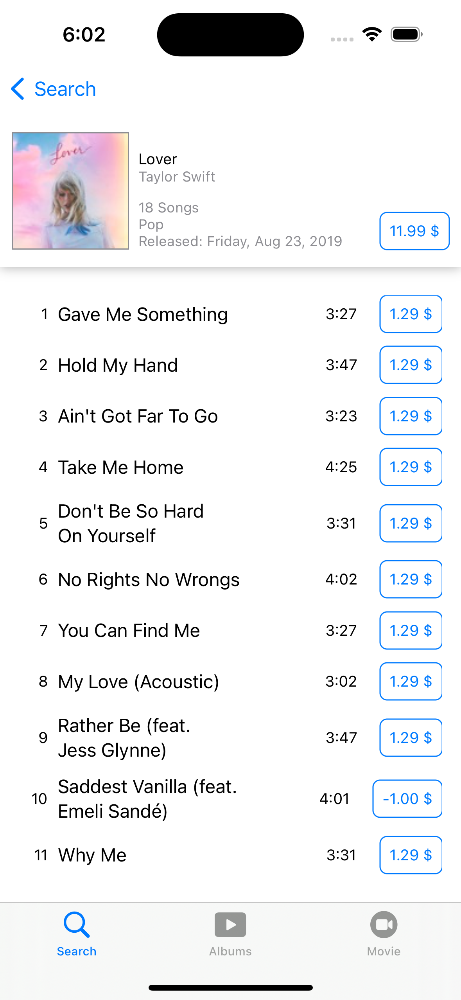

# iTunesSearchAPIDemo with SwiftUI + Combine with MVVM

We are using iTunes search API and mocking UI as well.


## Here we are using multiple news things from SwiftUI 

1. Tab Bar 
2. Grid view 
3. Home page with collection feels with LazyHStack and ScrollView
4. Async Image loading
5. ProgressView
6. @StateObject and @State
7. NavigationView with Group, list, other handling


## Network Request with Combine

```swift
protocol NetworkRequestProtocol {
    func getData<T: Codable>(_ requestable: Requestable, type: T.Type) -> Future<T, APIErrorHandler>
}

final class NetworkHandler: NetworkRequestProtocol {
        
    private var cancellable = Set<AnyCancellable>()
    
    func getData<T: Codable>(_ requestable: Requestable, type: T.Type) -> Future<T, APIErrorHandler> {
        return Future { [weak self] handler in
            guard let url = requestable.asRequestable(),
                  let strongsSelf = self else {
                return handler(.failure(.noURL))
            }            
            let session = URLSession.shared
            session.dataTaskPublisher(for: url)
                .tryMap { responseObj -> Data in
                    guard let resp = responseObj.response as? HTTPURLResponse,
                          (200...299) ~= resp.statusCode else {
                        throw APIErrorHandler.statusCode
                    }
                    return responseObj.data
                }
                .decode(type: T.self, decoder: JSONDecoder())
                .receive(on: RunLoop.main)
                .sink { completion in
                    switch completion {
                    case .failure(let error):
                        handler(.failure(APIErrorHandler.error(error)))
                    case .finished:
                        print("finished")
                    }
                } receiveValue: { result in
                    handler(.success(result))
                }
                .store(in: &strongsSelf.cancellable)
        }
    }
```    


| Features    | Screenshots |
| -------- | ------- |
| Home |     |
| Album Empty View |      |
| Album Loading View |     |
| Movie With Data |     |
| Album Detail view |     |
| Movie Detail view | coming soon ...    |


## API related

[iTunes Search API](https://developer.apple.com/library/archive/documentation/AudioVideo/Conceptual/iTuneSearchAPI/Searching.html#//apple_ref/doc/uid/TP40017632-CH5-SW1)


Pending items :

- Unit test cases
- Movie detail page 
- 